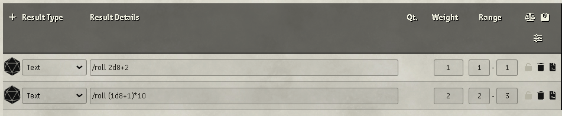
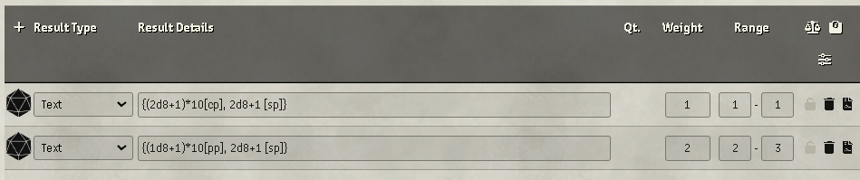

## Better RollTables

### VERY OLD DOCUMENTATION DEPRECATED

How to use [**Loot Tables**](./old/Loot-Tables.md)

How to use [Better RollTables Macros](./old/API-for-macros-and-modules#how-to-roll-tables-from-macros)

[FAQs](./old/FAQ.md)

## Common Features (These feature are present by default in all the BRT tables)

### Inline roll on table text result



Every BRT table apply inline roll on text table result with the prefix "roll/".

As a example a text like this:

```
/roll (1d4) +5
```

is converted runtime in this

```
Rolled: 7
```

### Customize images and names

With BRT, it is possbile to customize the images and names of items without editing them directly on the compendiums, which is useful for those who want to make a merchant more customized or differentiate products by zone


## Better Tables

*Work in progress, any help is welcomed*

## Loot Tables


### Inline currency data roll on table text result



Every BRT Loot table apply inline roll for the currency data on text rable result. 

**NOTE:** Every text table result in a type BRT Loot tables is treated as a currencyData formula and converted in a item piles supported formula.

This feature support many format from old and other modules here a list:

- Old brt format: `100*1d6[gp],4d4+4[sp] to 100*1d6gp 4d4+4sp`
- Harvester format: `[[/r 5d6]]{Copper} and [[/r 1d6*100]]{Electrum}[[/r 2d6*10]]`
- Old brt loot currency formula: `{(2d8+1)*10[cp], 6d8+3 [sp]}`
- Html code base with the editor: `<p>100*1d6[gp],4d4+4[sp]</p>`,`<p>[[/r 5d6]]{Copper} and [[/r 1d6*100]]{Electrum}[[/r 2d6*10]]</p>`, `<p>{(2d8+1)*10[cp], 6d8+3 [sp]}</p>`
- Item Piles format **(The advisable format to use)**: `((2d8+1)*10)cp (6d8+3)sp`

As a example a text like this:

```
{(2d8+1)*10[cp], 2d8+1 [sp]}
```

is converted runtime in this 

```
20cp 16sp
```


## Harvest Tables

*Work in progress, any help is welcomed*

## Story Tables

*Work in progress, any help is welcomed*
